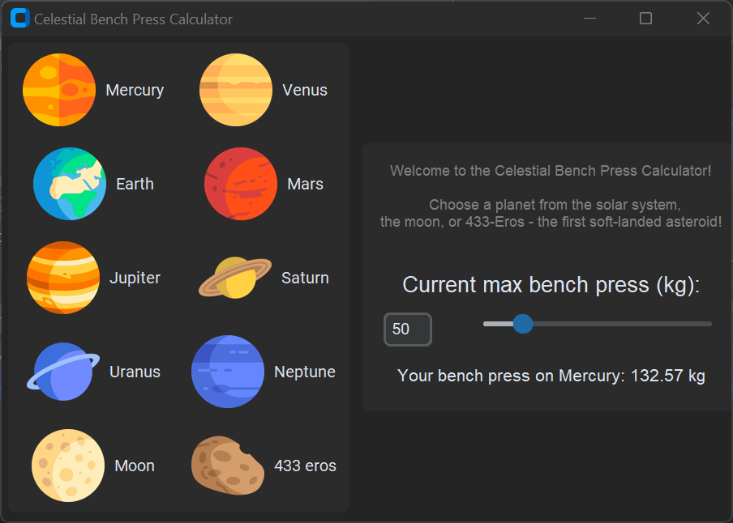

# Celestial Bench Press Calculator

Calculate your bench press weight on different celestial objects!

## Description

The Celestial Bench Press Calculator is a simple customtkinter-based application that allows you to calculate your bench press weight on various planets, the moon, and asteroid 433 Eros.

## Demo

## How It Works

1. Select a celestial object from the available planet buttons.
2. Enter your current max bench press weight (in kg) either through the slider or the input field.
3. The calculator will then display your bench press weight on the selected celestial object.

## Image Attribution

- icons: Icons created by Freepik - [Flaticon](https://www.flaticon.com)

## License

This project is licensed under the MIT License. See the [LICENSE](LICENSE) file for details.
